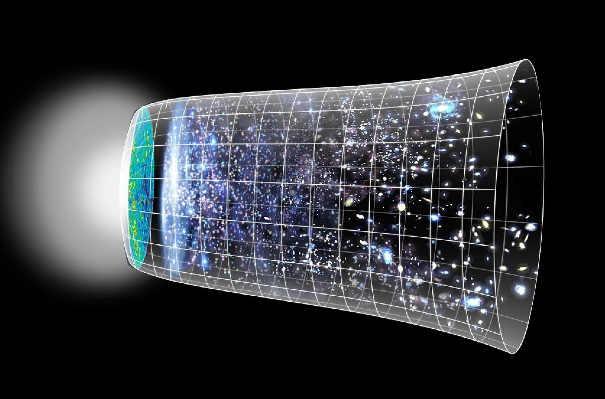

---
output:
  xaringan::moon_reader:
    lib_dir: libs
    css: [xaringan-themer.css, spacerock-theme.css]
    nature:
      
      highlightStyle: github
      highlightLines: true
      ratio: 16:9
      countIncrementalSlides: false
  revealjs::revealjs_presentation:
    self_contained: false
    reveal_plugins: ["menu"]
     
---

background-image: url(img/spacerocks1.jpg)
class: title-slide, center, middle, inverse
background-position: bottom
background-size: cover


.title[
.white[Space rocks!]
]


<style>
.title{
  font-size: 4em;
  font-style: bold;
}
.white{
  color: white;
}
</style>


---


```{r xaringan-themer, include=FALSE, warning=FALSE}
library(xaringanthemer)
style_duo_accent(
  primary_color = "#003459",
  secondary_color = "#007ea7",
  text_color = "#00171f",
  header_font_google = google_font("Josefin Sans", "300"),
  text_font_google = google_font("Montserrat", "300", "300i"),
  text_font_size = "1.5rem",
  header_h1_font_size = "3rem",
  header_h2_font_size = "2.25rem",
  header_h3_font_size = "2.1rem",
  code_font_google = google_font("Fira Mono")

)
```


```{r xaringanExtra-search, echo=FALSE}
xaringanExtra::use_search(show_icon = TRUE, position = c("bottom-right"))
```


```{r xaringanExtra-search-style, echo=FALSE}
xaringanExtra::style_search(match_background = "light blue")
```


```{r xaringan-tachyons, echo=FALSE}
xaringanExtra::use_tachyons()
```

```{r xaringanExtra, echo = FALSE}
xaringanExtra::use_progress_bar(color = "#0051BA", location = "top")
```


```{r xaringan-tile-view, echo=FALSE}
xaringanExtra::use_tile_view()

```

```{r xaringanExtra-freezeframe, echo=FALSE}
xaringanExtra::use_banner(
  top_left = "",
  top_right = "",
  bottom_left = "estebanmenesesg@gamail.com",
  exclude = "title-slide"
)
xaringanExtra::style_banner(
  text_color = "#F0F8FF",
  background_color = "#F0F8FF"
)
```

.pull-left[

# **How space rocks were formed in first place?**

# **What types of space rocks are there?**

]

.pull-right[


]


---

# **Origins**

.pull-left[

- Big Bang around 13.8 billion years (Energy, matter, Space, and time)


- Single densest sphere 


- How can we know this?


- What was before?


- How space rocks formed? (4.5 billons years) (from heavier)


]

.pull-right[

]

---
# **Classification**

.pull-left[

- Asteroids (biggest)

- Comets (mixture ice and rock)

- Meteoroid (solid stuff coming from space)

- Meteor (meteoroid getting hot and blazing by our atmosphere)

- Meteorites (hits the ground)


]

.pull-right[


]


---
# Group assignment

- Solar system.

- We are going to make 3 groups each one one has to present one of the main space rocks (Asteroid, Comets, and Meteoroids).

- Have to tell us about 3 things:

  - What are they made of?
  - Where they come from?
  - Its main classification.
  
You have 15 minutes to search and 2 minutes to present.

---


# **Asteroids (star-like)**

They are rocky, metallic or both, orbiting around the sun in between Mars and Jupiter (main belt). Classified as:


.pull-left[

- 75% carbon based (c-type).

- 17% are silicon based (s-type).

- 8% Miscellaneous (iron, nickel, and others - m-type).

- Some have moons.

]

.pull-right[
*Ceres (400 km in radius)


]

---
# **Comets**

.pull-left[

- Signs for predictions.

- Comets are a balance mixture of ice and rock. 

- Solid part called nucleus and gas tail called coma

- Comets have 2 tails: the gas tail and the dust tail.
]


.pull-right[
*Halley's Comet


]


---

# **Comets**

.pull-left[

Comets are classified by their orbits:

- Short period comets (< 200 years). 
  
  - Orbits as planets.
  - From scatter disk.

- Long-term comets (> 200 years).

  - They can appear everywhere.
  - From Oort cloud.
]

.pull-right[
*Orbits


]

---
background-image: url(img/kuiper.png)
background-position: 90% 90%
background-size: 50%


## **Where they go?**

--

- They evaporate becoming in asteroids

## **Can they hit the Earth?**

--

- Yes (live formed)

*Pluto is in the Kuiper belt object.


---
background-image: url(img/ort.jpg)
background-position: 50% 50%
background-size: contain

# **Oort Cloud**

.pull-left[
.white[

- Reach as 1 light year.

- No one knows a Oort object.

- These objects probably formed close to the sun.
]
]
<style>
.white{
  color: white;
}
</style>
---
background-image: url(img/meteor.jpg)
background-position: 50% 50%
background-size: contain

# **What is a shooting star?**


--

.white[


- Meteors have a huge amount of kinetic energy.

- As they hit our atmosphere they slow down.

- All that energy has to go somewhere.

- That energy is converted in light and heat.

]

<style>
.white{
  color: white;
}
</style>

---
background-image: url(img/shower.jpg)
background-position: 90% 50%
background-size: 50%

## **Where meteors come from?**

--

- From asteroids.

### **What about meteors showers?**

--

- They come from comet debris. 

- Named after the constellation.

- They are easy to see (after midnight).


---
# **Bolides or fireball**

.pull-left[

- These are extremely bright meteors.

- Sometime the pressure breaks them raining dozens or hundreds.

- They don't cause fires.

]

.pull-right[


]
---
# **Meteors classification**

.pull-left[

3 broad categories:

1. Stony.

1. Iron.

1. Stony iron.

*The majority of them are stony.
]

.pull-right[


]
---

# **Recap**

# **How space rocks were formed in first place?**

# **What types of space rocks are there?**


